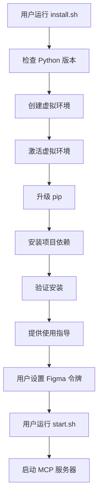

# Figma MCP Server 项目总结

> **English Version**: [PROJECT_SUMMARY_EN.md](PROJECT_SUMMARY_EN.md)

## 📁 项目结构

```
figma-mcp-server/
├── 📄 README.md                    # 项目主要文档
├── 📄 README_PACKAGE.md            # 详细的包说明文档
├── 📄 USAGE.md                     # 使用指南
├── 📄 PROJECT_SUMMARY.md           # 项目总结（中文版）
├── 📄 PROJECT_SUMMARY_EN.md        # 项目总结（英文版）
├── 📄 pyproject.toml               # 项目配置和依赖管理
├── 📄 MANIFEST.in                  # 打包配置
├── 📄 figma-mcp-package.json       # MCP 包配置
├── 
├── 🔧 install.sh                   # macOS/Linux 安装脚本
├── 🔧 install.bat                  # Windows 安装脚本
├── 🔧 start.sh                     # 快速启动脚本
├── 
├── 📦 figma_mcp_server/            # 主要代码包
│   ├── __init__.py                 # 包初始化
│   ├── server.py                   # MCP 服务器主文件
│   ├── cli.py                      # 命令行接口
│   ├── figma_tree_extractor.py     # 树结构提取器
│   ├── figma_image_extractor.py    # 图片提取器
│   ├── figma_frame_extractor.py    # Frame 节点提取器
│   └── figma_node_lister.py        # 节点列表器
├── 
├── 🧪 mcp_client_test.py           # MCP 客户端测试
├── 🧪 minimal_mcp_test.py          # 最小化 MCP 测试
└── ⚙️ cursor_mcp_config.json       # Cursor MCP 配置示例
```

## 🚀 安装脚本说明

### install.sh (macOS/Linux)
- ✅ 检查 Python 版本 (>= 3.10)
- ✅ 创建虚拟环境 `figma-mcp-env`
- ✅ 激活虚拟环境
- ✅ 升级 pip
- ✅ 安装项目依赖
- ✅ 验证安装结果
- ✅ 提供后续使用指导

### install.bat (Windows)
- ✅ 检查 Python 版本
- ✅ 创建虚拟环境 `figma-mcp-env`
- ✅ 激活虚拟环境
- ✅ 升级 pip
- ✅ 安装项目依赖
- ✅ 验证安装结果
- ✅ 提供后续使用指导

### start.sh (快速启动)
- ✅ 检查虚拟环境是否存在
- ✅ 激活虚拟环境
- ✅ 检查 Figma 访问令牌
- ✅ 启动 MCP 服务器

## 🔧 解决的问题

### 1. Python 环境问题
- **问题**: 系统 Python 和 Homebrew Python 不一致
- **解决**: 使用虚拟环境隔离依赖

### 2. 依赖管理问题
- **问题**: setup.py 依赖不存在的 requirements.txt
- **解决**: 删除 setup.py，使用 pyproject.toml

### 3. 安装复杂性
- **问题**: 手动安装步骤繁琐
- **解决**: 提供一键安装脚本

### 4. 使用便利性
- **问题**: 每次需要手动激活环境
- **解决**: 提供快速启动脚本

## 📋 安装流程



## 🎯 使用场景

### 开发者工作流
1. **设计审查** → 提取 Figma 设计数据
2. **组件分析** → 理解设计结构和约束
3. **代码生成** → 从结构化数据生成组件
4. **视觉验证** → 比较代码与设计

### AI 辅助开发
1. **上下文管理** → 按页面组织数据
2. **迭代开发** → 一次处理一个页面
3. **设计到代码** → 直接转换 Figma 到代码
4. **质量保证** → 视觉比较验证

## 💡 最佳实践

1. **使用安装脚本**: 避免手动配置环境
2. **虚拟环境**: 隔离项目依赖
3. **令牌管理**: 安全存储 Figma 访问令牌
4. **分批处理**: 避免一次提取过多数据
5. **合理缩放**: 根据需要选择图片质量

## 🔮 未来改进

- [ ] 添加 Docker 支持
- [ ] 支持更多图片格式
- [ ] 添加批量处理功能
- [ ] 改进错误处理
- [ ] 添加日志系统
- [ ] 支持配置文件
