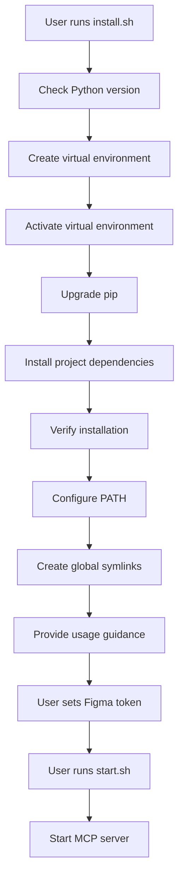

# Figma MCP Server Project Summary

> **Chinese Version**: [PROJECT_SUMMARY.md](PROJECT_SUMMARY.md)

## 📁 Project Structure

```
figma-mcp-server/
├── 📄 README.md                    # Main project documentation
├── 📄 README_PACKAGE.md            # Detailed package documentation
├── 📄 USAGE.md                     # Usage guide
├── 📄 PROJECT_SUMMARY.md           # Project summary (Chinese)
├── 📄 PROJECT_SUMMARY_EN.md        # Project summary (English)
├── 📄 pyproject.toml               # Project configuration and dependency management
├── 📄 MANIFEST.in                  # Packaging configuration
├── 📄 figma-mcp-package.json       # MCP package configuration
├── 
├── 🔧 install.sh                   # macOS/Linux installation script
├── 🔧 install.bat                  # Windows installation script
├── 🔧 start.sh                     # Quick start script
├── 
├── 📦 figma_mcp_server/            # Main code package
│   ├── __init__.py                 # Package initialization
│   ├── server.py                   # MCP server main file
│   ├── cli.py                      # Command line interface
│   ├── figma_tree_extractor.py     # Tree structure extractor
│   ├── figma_image_extractor.py    # Image extractor
│   ├── figma_frame_extractor.py    # Frame node extractor
│   └── figma_node_lister.py        # Node lister
├── 
├── 🧪 mcp_client_test.py           # MCP client test
├── 🧪 minimal_mcp_test.py          # Minimal MCP test
└── ⚙️ cursor_mcp_config.json       # Cursor MCP configuration example
```

## 🚀 Installation Script Features

### install.sh (macOS/Linux)
- ✅ Check Python version (>= 3.10)
- ✅ Create virtual environment `figma-mcp-env`
- ✅ Activate virtual environment
- ✅ Upgrade pip
- ✅ Install project dependencies
- ✅ Verify installation results
- ✅ Provide follow-up usage guidance
- ✅ Configure PATH environment variable
- ✅ Create global symbolic links (optional)
- ✅ Provide bilingual installation prompts (Chinese/English)

### install.bat (Windows)
- ✅ Check Python version
- ✅ Create virtual environment `figma-mcp-env`
- ✅ Activate virtual environment
- ✅ Upgrade pip
- ✅ Install project dependencies
- ✅ Verify installation results
- ✅ Provide follow-up usage guidance
- ✅ Configure PATH environment variable
- ✅ Create global symbolic links (optional)
- ✅ Provide bilingual installation prompts (Chinese/English)

### start.sh (Quick Start)
- ✅ Check if virtual environment exists
- ✅ Activate virtual environment
- ✅ Check Figma access token
- ✅ Start MCP server

## 🔧 Problems Solved

### 1. Python Environment Issues
- **Problem**: Inconsistency between system Python and Homebrew Python
- **Solution**: Use virtual environment to isolate dependencies

### 2. Dependency Management Issues
- **Problem**: setup.py depends on non-existent requirements.txt
- **Solution**: Remove setup.py, use pyproject.toml

### 3. Installation Complexity
- **Problem**: Manual installation steps are cumbersome
- **Solution**: Provide one-click installation scripts

### 4. Usage Convenience
- **Problem**: Need to manually activate environment each time
- **Solution**: Provide quick start script

### 5. Internationalization
- **Problem**: Installation messages only in Chinese
- **Solution**: Add bilingual support (Chinese/English)

## 📋 Installation Flow



## 🎯 Use Cases

### Developer Workflow
1. **Design Review** → Extract Figma design data
2. **Component Analysis** → Understand design structure and constraints
3. **Code Generation** → Generate components from structured data
4. **Visual Verification** → Compare code with design

### AI-Assisted Development
1. **Context Management** → Organize data by pages
2. **Iterative Development** → Process one page at a time
3. **Design-to-Code** → Direct conversion from Figma to code
4. **Quality Assurance** → Visual comparison verification

## 💡 Best Practices

1. **Use installation scripts**: Avoid manual environment configuration
2. **Virtual environment**: Isolate project dependencies
3. **Token management**: Securely store Figma access tokens
4. **Batch processing**: Avoid extracting too much data at once
5. **Reasonable scaling**: Choose image quality based on needs
6. **Bilingual support**: Provide Chinese and English interfaces

## 🔮 Future Improvements

- [ ] Add Docker support
- [ ] Support more image formats
- [ ] Add batch processing functionality
- [ ] Improve error handling
- [ ] Add logging system
- [ ] Support configuration files
- [ ] Add more language support
- [ ] Improve global command accessibility
