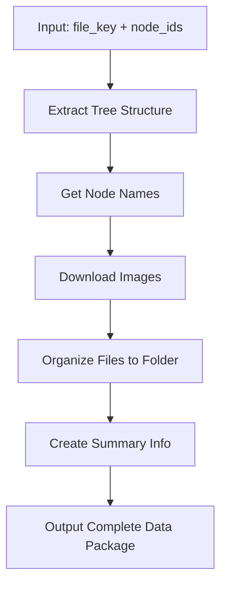

# Figma MCP Server

> **English**: README.en.md | **中文**: [README.zh-CN.md](README.zh-CN.md)

[](README.en.md)
[](README.zh-CN.md)

A specialized MCP server designed for **developers** to systematically extract and organize Figma design files at the **page level**. This tool transforms Figma designs into structured data (JSON + PNG images) that AI can easily understand and process, while avoiding overly long contexts by organizing data by individual pages.

## 🎯 **Core Purpose**

This MCP server is specifically built for **programmers** who need to:
- Extract Figma designs into AI-processable formats
- Organize design data by **page/component level** for systematic development
- Avoid context overflow by splitting large design files into manageable chunks
- Generate structured design data that can be directly used for code generation

## 🏗️ **Page-Level Organization Strategy**

Instead of processing entire Figma files at once (which can be overwhelming), this tool:
- **Breaks down designs by pages/components** - Each page becomes a separate, manageable unit
- **Provides structured node information** - Complete design hierarchy, constraints, and styling data
- **Includes visual references** - High-quality images for visual verification
- **Maintains context boundaries** - Each page fits comfortably within AI context limits

## Features

- ⭐ **Page-Level Data Extraction** - Extract complete design data organized by pages/components
- 🔍 **Structured Node Information** - Complete design hierarchy, constraints, and styling data
- 🖼️ **Visual References** - High-quality images for each page/component
- 📊 **Context-Aware Processing** - Avoid context overflow by processing manageable chunks
- 📁 **Developer-Friendly Output** - Organized folders with clear naming conventions
- 🔧 **MCP Integration** - Seamless integration with MCP-compatible AI assistants
- 💡 **AI-Optimized Structure** - Output format designed specifically for AI understanding

## 🚀 **Use Cases for Developers**

### **Frontend Development Workflow**
1. **Design Review**: Extract page-level designs from Figma
2. **Component Analysis**: Understand design structure and constraints
3. **Code Generation**: Generate React/Vue/Angular components from structured data
4. **Visual Verification**: Compare generated code with design images

### **Design System Development**
1. **Component Library**: Extract and organize design system components
2. **Style Guide Generation**: Create comprehensive style documentation
3. **Token Extraction**: Extract design tokens for consistent theming
4. **Responsive Design**: Analyze constraints for responsive implementation

### **AI-Assisted Development**
1. **Context Management**: Keep AI context focused on specific pages
2. **Iterative Development**: Process one page at a time for better AI understanding
3. **Design-to-Code**: Direct conversion from Figma designs to production code
4. **Quality Assurance**: Visual comparison between design and implementation

## Installation

### Method 1: Using Installation Scripts (Recommended)

The installation scripts automatically perform the following operations:
- ✅ Check Python version (requires 3.10+)
- ✅ Create virtual environment
- ✅ Install project dependencies
- ✅ Configure PATH environment variable automatically
- ✅ Create global symbolic links for global command access
- ✅ Update shell configuration files (.zshrc, .bashrc)
- ✅ Provide bilingual installation prompts (Chinese/English)
- ✅ Verify command availability after installation

**macOS/Linux:**
```bash
# Clone the repository
git clone https://github.com/DRX-1877/figma-mcp-server.git
cd figma-mcp-server

# Run installation script (automatically configures environment)
./install.sh
```

**Windows:**
```cmd
# Clone the repository
git clone https://github.com/DRX-1877/figma-mcp-server.git
cd figma-mcp-server

# Run installation script (automatically configures environment)
install.bat
```

**That's it!** The command will be available globally after installation.

**就这么简单！** 安装后命令即可全局使用。

### Method 2: Manual Installation

1. Create and activate virtual environment:
```bash
python3 -m venv figma-mcp-env
source figma-mcp-env/bin/activate  # macOS/Linux
# or
figma-mcp-env\Scripts\activate     # Windows
```

2. Install the project:
```bash
pip install -e .
```

### Method 3: From PyPI (Recommended)

```bash
pip install figma-mcp-tools
```

## Global Command Availability

After installation, the `figma-mcp-tools` command will be available **globally** from any directory:

### macOS/Linux
```bash
# Use from any directory
figma-mcp-tools --help

# If command is not available, run the fix script
./fix-command.sh

# Or manually reload shell configuration
source ~/.zshrc  # for zsh
# or
source ~/.bashrc # for bash
```

### Windows
```cmd
# Use from any directory
figma-mcp-tools --help

# If command is not available, run the fix script
fix-command.bat

# Or reopen command prompt to reload environment variables
```

### Automatic Environment Configuration

The installation script automatically configures your environment:

- **PATH Configuration**: Adds virtual environment and local bin directories to PATH
- **Global Symlinks**: Creates symbolic links in system directories
- **Shell Integration**: Updates shell configuration files (.zshrc, .bashrc)

**No manual configuration required!** 🎉

### Troubleshooting

If the command is not available after installation:

#### macOS/Linux
```bash
# Option 1: Run the fix script
./fix-command.sh

# Option 2: Manually reload shell configuration
source ~/.zshrc  # for zsh
# or
source ~/.bashrc # for bash

# Option 3: Open a new terminal window
```

#### Windows
```cmd
# Option 1: Run the fix script
fix-command.bat

# Option 2: Reopen command prompt

# Option 3: Restart computer
```

## Setup

1. **Get Figma Access Token**
   - Go to [Figma Settings > Account > Personal access tokens](https://www.figma.com/settings)
   - Create a new access token
   - Copy the token

2. **Set Environment Variable**
   ```bash
   # macOS/Linux
   export FIGMA_ACCESS_TOKEN='your_token_here'
   
   # Windows
   set FIGMA_ACCESS_TOKEN=your_token_here
   ```

## Usage

### Command Line

```bash
figma-mcp-server
```

### MCP Configuration

Add to your MCP configuration file (e.g., `~/.cursor/mcp.json`):

```json
{
  "mcpServers": {
    "figma-tools": {
      "command": "figma-mcp-server",
      "env": {
        "FIGMA_ACCESS_TOKEN": "your_token_here"
      }
    }
  }
}
```

**Note:** If you used the installation scripts, the `figma-mcp-server` command is available globally, so you can use it directly without specifying the full path.

## Main Feature: Complete Node Data Extraction

### get_complete_node_data ⭐ **Primary Tool**
Get complete node data (tree structure + images) and organize into folders

**Workflow:**


- **Parameters**:
  - `file_key`: Figma file unique identifier
  - `node_ids`: Node IDs, comma-separated
  - `image_format`: Image format (default: png)
  - `image_scale`: Image scale factor (default: 1.0)
  - `tree_depth`: Tree depth (default: 4)

**Output Structure:**
```
your_node_name_your_node_id_here/
├── nodesinfo.json    # Complete tree structure data (core)
└── your_node_id_here.png  # Downloaded image file
```

### 🧠 **Why This Structure for AI Understanding**

This output structure is specifically designed to help AI understand design comprehensively:

#### **Multi-modal Information Fusion**
- **Structured Data** (`nodesinfo.json`): Contains precise positioning, styling, constraints, and hierarchical relationships
- **Visual Data** (`.png`): Provides actual rendered appearance for visual verification
- **Contextual Information**: File naming and organization provide design context

#### **AI-Friendly Design**
- **Complete Context**: AI can understand both the logical structure and visual appearance
- **Relationship Clarity**: Hierarchical relationships and constraints are explicitly defined
- **Parseable Format**: JSON structure allows AI to easily extract and process information

#### **Real-world AI Use Cases**
- **Design Analysis**: "This page has 12 frames, 18 text elements, uses white background..."
- **Code Generation**: "Based on layout constraints, generate React component with 375px width..."
- **Design Suggestions**: "45 nodes detected, consider componentization to reduce complexity..."
- **Responsive Adaptation**: "Header uses SCALE constraint, needs mobile layout adjustment..."

#### **Optimized Structure**
- **Essential Only**: Contains only the most important files for AI understanding
- **Efficient Data**: Compact output structure while maintaining all necessary information
- **Cost Effective**: Minimizes API token usage while maximizing AI understanding

## Individual Process Tools

For specific use cases, you can also call these individual processes separately:

### 1. extract_figma_tree
Extract complete tree structure of Figma nodes
- **Parameters**:
  - `file_key`: Figma file unique identifier
  - `node_ids`: Node IDs, comma-separated
  - `depth`: Tree depth (default: 4)

### 2. download_figma_images
Download images of Figma nodes
- **Parameters**:
  - `file_key`: Figma file unique identifier
  - `node_ids`: Node IDs, comma-separated
  - `format`: Image format (png, jpg, svg, pdf)
  - `scale`: Scale factor (0.01-4)

### 3. extract_frame_nodes
Extract Frame node information from Figma files
- **Parameters**:
  - `file_key`: Figma file unique identifier
  - `max_depth`: Maximum depth (default: 2)

## Example Usage

### Step 1: Get Node IDs
First, use the `list_nodes_depth2` tool to find the node IDs you need:

```python
# List all nodes to find the ones you want
{
  "file_key": "your_figma_file_key_here",
  "node_types": "FRAME,COMPONENT"  # Optional: filter by node types
}
```

### Step 2: Extract Complete Data
Then use the node IDs with the main tool:

⚠️ **Important: API Token Usage Warning**
- Complete node data extraction consumes significant API quota
- Each node's full information can be very large (thousands of fields)
- Use `list_nodes_depth2` first to identify only the nodes you need
- This two-step process helps minimize API costs and processing time
- **Optimized output**: Only essential files (nodesinfo.json + image) for efficient AI processing

```python
# Get complete node data (recommended)
{
  "file_key": "your_figma_file_key_here",
  "node_ids": "node_id_from_step_1",
  "image_format": "png",
  "image_scale": 2.0,
  "tree_depth": 4
}
```

### Individual Process Examples

```python
# Extract tree structure only
{
  "file_key": "your_figma_file_key_here",
  "node_ids": "your_node_id_here",
  "depth": 4
}

# Download images only
{
  "file_key": "your_figma_file_key_here",
  "node_ids": "your_node_id_here",
  "format": "png",
  "scale": 2.0
}
```

## 💡 **Best Practices**

### API Token Usage Optimization
1. **Always start with `list_nodes_depth2`** to identify specific nodes
2. **Use node type filtering** to reduce the list size (e.g., `FRAME,COMPONENT`)
3. **Extract only what you need** - avoid getting complete data for all nodes
4. **Consider using individual tools** instead of `get_complete_node_data` for simple tasks

### When to Use Each Tool
- **`list_nodes_depth2`**: Always first step - find node IDs
- **`get_complete_node_data`**: When you need everything (tree + images + organization)
- **`extract_figma_tree`**: When you only need structure data
- **`download_figma_images`**: When you only need images
- **`extract_frame_nodes`**: When you need Frame-specific information

## Development

### Setup Development Environment

```bash
git clone https://github.com/DRX-1877/figma-mcp-server.git
cd figma-mcp-server
pip install -e ".[dev]"
```

### Run Tests

```bash
pytest
```

### Code Formatting

```bash
black figma_mcp_server/
```

## License

MIT License - see [LICENSE](LICENSE) file for details.

## Contributing

1. Fork the repository
2. Create a feature branch
3. Make your changes
4. Add tests
5. Submit a pull request

## Support

- 📖 [Documentation](https://github.com/DRX-1877/figma-mcp-server#readme)
- 🐛 [Bug Reports](https://github.com/DRX-1877/figma-mcp-server/issues)
- 💬 [Discussions](https://github.com/DRX-1877/figma-mcp-server/discussions)

## Changelog

### 1.0.0
- Initial release
- Basic Figma tree extraction
- Image download functionality
- Frame node analysis
- MCP server integration
