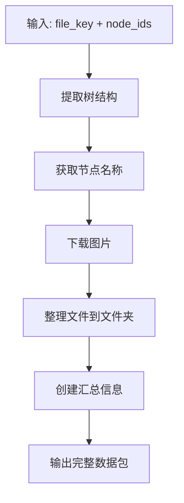

# Figma 完整节点数据获取器

一个专门为**程序员**设计的MCP服务器，用于系统性地按**页面级别**提取和组织Figma设计文件。这个工具将Figma设计转换为结构化数据（JSON + PNG图片），让AI能够轻松理解和处理，同时通过按页面组织数据来避免上下文过长的问题。

## 🎯 **核心目的**

这个MCP服务器专门为**程序员**构建，他们需要：
- 将Figma设计提取为AI可处理的格式
- 按**页面/组件级别**组织设计数据，便于系统化开发
- 通过将大型设计文件拆分为可管理的块来避免上下文溢出
- 生成可直接用于代码生成的结构化设计数据

## 🏗️ **页面级组织策略**

与一次性处理整个Figma文件（可能过于复杂）不同，这个工具：
- **按页面/组件拆分设计** - 每个页面成为一个独立的、可管理的单元
- **提供结构化节点信息** - 完整的设计层次、约束和样式数据
- **包含视觉参考** - 高质量图片用于视觉验证
- **维护上下文边界** - 每个页面都能舒适地适应AI上下文限制

## 功能

- ⭐ **页面级数据提取** - 按页面/组件提取完整的设计数据
- **结构化节点信息** - 完整的设计层次、约束和样式数据
- **视觉参考** - 每个页面/组件的高质量图片
- **上下文感知处理** - 通过处理可管理的块来避免上下文溢出
- **开发者友好输出** - 组织良好的文件夹，命名清晰
- **MCP服务器** - 提供MCP接口，供AI助手调用
- **AI优化结构** - 专门为AI理解设计的输出格式

## 文件结构

```
├── figma_frame_extractor.py    # Frame节点提取器类
├── figma_tree_extractor.py     # 树结构提取器类
├── figma_image_extractor.py    # 图片提取器类
├── figma_mcp_server.py         # MCP服务器
├── get_complete_node_data.py   # 整合脚本（主要使用）
├── start_mcp_server.sh         # MCP服务器启动脚本
├── figma-mcp.json              # MCP配置文件
├── requirements.txt            # 依赖文件
└── pages/                      # 原始数据文件夹
```

## 🚀 **开发者使用场景**

### **前端开发工作流**
1. **设计审查**：从Figma提取页面级设计
2. **组件分析**：理解设计结构和约束
3. **代码生成**：从结构化数据生成React/Vue/Angular组件
4. **视觉验证**：比较生成的代码与设计图片

### **设计系统开发**
1. **组件库**：提取和组织设计系统组件
2. **样式指南生成**：创建全面的样式文档
3. **Token提取**：提取设计令牌以保持主题一致性
4. **响应式设计**：分析约束以实现响应式布局

### **AI辅助开发**
1. **上下文管理**：保持AI上下文专注于特定页面
2. **迭代开发**：一次处理一个页面以获得更好的AI理解
3. **设计到代码**：从Figma设计直接转换为生产代码
4. **质量保证**：设计实现之间的视觉比较

## 安装

1. 创建并激活虚拟环境：
```bash
python3.10 -m venv figma_env
source figma_env/bin/activate
```

2. 安装依赖：
```bash
pip install --upgrade pip
pip install requests
pip install git+https://github.com/modelcontextprotocol/python-sdk.git
```

3. 获取Figma Access Token：
   - 登录Figma
   - 进入Settings > Account > Personal access tokens
   - 创建新的access token

## 使用方法

### 主要使用方式（推荐）

1. 设置环境变量：
```bash
export FIGMA_ACCESS_TOKEN='your_token_here'
```

2. 运行整合脚本：
```bash
# 基本用法
python3 get_complete_node_data.py your_figma_file_key_here your_node_id_here

# 指定图片格式和缩放
python3 get_complete_node_data.py your_figma_file_key_here your_node_id_here png 2

# 获取多个节点
python3 get_complete_node_data.py your_figma_file_key_here your_node_id_here,your_second_node_id_here png 1
```

### 单独使用各个类

```bash
# 提取Frame节点信息
python3 figma_frame_extractor.py your_figma_file_key_here

# 提取树结构
python3 figma_tree_extractor.py your_figma_file_key_here your_node_id_here

# 下载图片
python3 figma_image_extractor.py your_figma_file_key_here your_node_id_here png 1
```

### MCP服务器使用

1. 启动MCP服务器：
```bash
./start_mcp_server.sh
```

2. 在支持MCP的AI助手中配置：
   - 服务器名称：`figma-tools`
   - 命令：`python3`
   - 参数：`figma_mcp_server.py`
   - 环境变量：`FIGMA_ACCESS_TOKEN`

## 主要功能：完整节点数据提取

### get_complete_node_data ⭐ **主要工具**
获取Figma节点的完整数据（树结构+图片），并整理到文件夹

⚠️ **重要提醒：API Token使用警告**
- 完整节点数据提取会消耗大量API配额
- 每个节点的完整信息可能包含数千个字段，数据量很大
- 建议先使用 `list_nodes_depth2` 工具识别需要的节点
- 这种两步式流程有助于最小化API成本和处理时间

**工作流程：**


**输出结构：**
```
your_node_name_your_node_id_here/
├── nodesinfo.json    # 节点详细信息（完整树结构，核心数据）
└── your_node_id_here.png  # 图片文件
```

### 🧠 **为什么这样设计输出结构**

这个输出结构专门为AI理解设计而设计：

#### **多模态信息融合**
- **结构化数据** (`nodesinfo.json`)：包含精确的位置、样式、约束和层次关系
- **视觉数据** (`.png`)：提供实际渲染效果用于视觉验证
- **上下文信息**：文件命名和组织提供设计上下文

#### **AI友好的设计**
- **完整上下文**：AI能同时理解逻辑结构和视觉外观
- **关系清晰**：层次关系和约束被明确定义
- **易于解析**：JSON结构让AI能轻松提取和处理信息

#### **实际AI使用场景**
- **设计分析**："这个页面有12个Frame，18个文本元素，使用白色背景..."
- **代码生成**："基于布局约束，生成375px宽度的React组件..."
- **设计建议**："检测到45个节点，建议组件化以减少复杂度..."
- **响应式适配**："Header使用SCALE约束，需要移动端布局调整..."

#### **优化结构**
- **只保留核心**：包含AI理解设计所需的最重要文件
- **高效数据**：紧凑的输出结构，同时保持所有必要信息
- **成本效益**：最小化API token使用的同时最大化AI理解能力

## 单独调用工具

如需特定功能，也可以单独调用以下工具：

3. 可用的MCP工具：
   - `extract_figma_tree` - 提取节点树结构
   - `download_figma_images` - 下载节点图片
   - `get_complete_node_data` ⭐ **主要工具** - 获取完整节点数据
   - `extract_frame_nodes` - 提取Frame节点

## 输出示例

```
=== Figma 完整节点数据获取器 ===
文件Key: your_figma_file_key_here
节点IDs: your_node_id_here
图片格式: png
缩放比例: 1.0

步骤1: 获取节点树结构...
步骤2: 获取节点图片...
步骤3: 整理文件...
步骤4: 创建汇总信息...

=== 完成 ===
所有文件已整理到文件夹: your_node_name_your_node_id_here
包含文件:
  - nodesinfo.json (节点详细信息，核心数据)
  - 图片文件: your_node_id_here.png
```

## 输出文件结构

生成的文件夹结构：
```
your_node_name_your_node_id_here/
├── nodesinfo.json    # 节点详细信息（完整树结构，核心数据）
└── your_node_id_here.png        # 图片文件
```

## 参数说明

### 主要工具参数

#### get_complete_node_data ⭐ **推荐使用**
- `file_key` - Figma文件唯一标识符（必需）
- `node_ids` - 节点ID，多个用逗号分隔（必需）
- `image_format` - 图片格式：png, jpg, svg, pdf（可选，默认png）
- `image_scale` - 图片缩放比例：0.01-4（可选，默认1.0）
- `tree_depth` - 树结构深度（可选，默认4）

### 单独工具参数

#### extract_figma_tree
- `file_key` - Figma文件唯一标识符
- `node_ids` - 节点ID，多个用逗号分隔
- `depth` - 树结构深度，默认4

#### download_figma_images
- `file_key` - Figma文件唯一标识符
- `node_ids` - 节点ID，多个用逗号分隔
- `format` - 图片格式：png, jpg, svg, pdf
- `scale` - 缩放比例：0.01-4

#### extract_frame_nodes
- `file_key` - Figma文件唯一标识符
- `max_depth` - 最大深度，默认2

### 图片格式选项
- `png` - PNG格式，适合网页使用
- `jpg` - JPG格式，文件较小
- `svg` - SVG格式，矢量图形
- `pdf` - PDF格式，适合打印

## 注意事项

- 需要对该Figma文件有访问权限
- Access token请妥善保管，不要泄露
- 图片下载可能需要一些时间，取决于图片大小和网络状况
- 文件夹名称格式：`节点名称_节点ID`
- 支持批量处理多个节点，但建议一次处理不超过10个节点
- MCP服务器需要Python 3.10或更高版本
