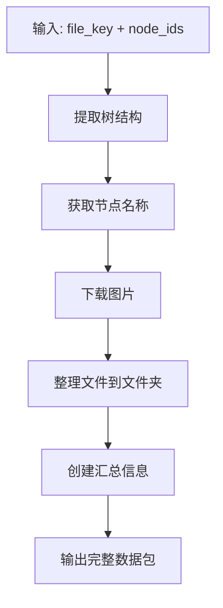

# Figma 完整节点数据获取器

> **English**: [README.en.md](README.en.md) | **中文**: README.zh-CN.md

[](README.en.md)
[](README.zh-CN.md)

一个专门为**程序员**设计的MCP服务器，用于系统性地按**页面级别**提取和组织Figma设计文件。这个工具将Figma设计转换为结构化数据（JSON + PNG图片），让AI能够轻松理解和处理，同时通过按页面组织数据来避免上下文过长的问题。

## 🎯 **核心目的**

这个MCP服务器专门为**程序员**构建，他们需要：
- 将Figma设计提取为AI可处理的格式
- 按**页面/组件级别**组织设计数据，便于系统化开发
- 通过将大型设计文件拆分为可管理的块来避免上下文溢出
- 生成可直接用于代码生成的结构化设计数据

## 🏗️ **页面级组织策略**

与一次性处理整个Figma文件（可能过于复杂）不同，这个工具：
- **按页面/组件拆分设计** - 每个页面成为一个独立的、可管理的单元
- **提供结构化节点信息** - 完整的设计层次、约束和样式数据
- **包含视觉参考** - 高质量图片用于视觉验证
- **维护上下文边界** - 每个页面都能舒适地适应AI上下文限制

## 🎯 **主要功能：完整节点数据提取**

### get_complete_node_data ⭐ **主要工具**
获取Figma节点的完整数据（树结构+图片），并整理到文件夹

**工作流程：**


- **参数**:
  - `file_key`: Figma文件唯一标识符
  - `node_ids`: 节点ID，逗号分隔
  - `image_format`: 图片格式（默认：png）
  - `image_scale`: 图片缩放因子（默认：1.0）
  - `tree_depth`: 树深度（默认：4）

**输出结构：**
```
your_node_name_your_node_id_here/
├── nodesinfo.json    # 完整树结构数据（核心）
└── your_node_id_here.png  # 下载的图片文件
```

### 🧠 **为什么这种结构适合 AI 理解**

这个输出结构专门设计用于帮助 AI 全面理解设计：

#### **多模态信息融合**
- **结构化数据** (`nodesinfo.json`): 包含精确的定位、样式、约束和层次关系
- **视觉数据** (`.png`): 提供实际渲染外观用于视觉验证
- **上下文信息**: 文件命名和组织提供设计上下文

#### **AI 友好设计**
- **完整上下文**: AI 可以理解逻辑结构和视觉外观
- **关系清晰**: 层次关系和约束被明确定义
- **可解析格式**: JSON 结构允许 AI 轻松提取和处理信息

#### **实际 AI 使用场景**
- **设计分析**: "此页面有 12 个框架，18 个文本元素，使用白色背景..."
- **代码生成**: "基于布局约束，生成宽度为 375px 的 React 组件..."
- **设计建议**: "检测到 45 个节点，考虑组件化以减少复杂性..."
- **响应式适配**: "头部使用 SCALE 约束，需要移动端布局调整..."

#### **优化结构**
- **仅包含必要**: 仅包含 AI 理解所需的最重要文件
- **高效数据**: 紧凑的输出结构，同时保持所有必要信息
- **成本效益**: 最小化 API 令牌使用，同时最大化 AI 理解

## 功能

- 📋 **节点列表** (`list_nodes_depth2`) - 列出Figma文件中的所有节点，深度控制
- 🔍 **树结构提取** (`extract_figma_tree`) - 提取Figma节点的完整树结构
- 🖼️ **图片下载** (`download_figma_images`) - 下载Figma设计图片，支持多种格式（PNG、JPG、SVG、PDF）
- 🔧 **完整数据导出** (`get_complete_node_data`) - 获取完整节点数据（树结构+图片），为AI理解而组织
- 🖼️ **框架提取** (`extract_frame_nodes`) - 提取Figma文件中的Frame节点信息
- 🌐 **跨平台支持** - 支持macOS、Linux和Windows
- 💡 **AI优化结构** - 专门为AI理解设计的输出格式

## 项目结构

```
figma-mcp-server/
├── figma_mcp_server/           # 核心包目录
│   ├── __init__.py
│   ├── server.py              # MCP服务器主文件
│   ├── cli.py                 # 命令行接口
│   ├── figma_frame_extractor.py    # Frame节点提取器
│   ├── figma_tree_extractor.py     # 树结构提取器
│   ├── figma_image_extractor.py    # 图片提取器
│   └── figma_node_lister.py        # 节点列表工具
├── install.sh                 # Linux/macOS 安装脚本
├── install.bat                # Windows 安装脚本
├── start.sh                   # 启动脚本
├── debug_server_v3.py         # 调试服务器
├── pyproject.toml             # 项目配置
├── README.md                  # 中文说明文档
├── README_PACKAGE.md          # 英文说明文档
├── USAGE.md                   # 使用说明
└── figma-mcp-env/             # 虚拟环境（安装后生成）
```

## 🚀 **开发者使用场景**

### **前端开发工作流**
1. **设计审查**：从Figma提取页面级设计
2. **组件分析**：理解设计结构和约束
3. **代码生成**：从结构化数据生成React/Vue/Angular组件
4. **视觉验证**：比较生成的代码与设计图片

### **设计系统开发**
1. **组件库**：提取和组织设计系统组件
2. **样式指南生成**：创建全面的样式文档
3. **Token提取**：提取设计令牌以保持主题一致性
4. **响应式设计**：分析约束以实现响应式布局

### **AI辅助开发**
1. **上下文管理**：保持AI上下文专注于特定页面
2. **迭代开发**：一次处理一个页面以获得更好的AI理解
3. **设计到代码**：从Figma设计直接转换为生产代码
4. **质量保证**：设计实现之间的视觉比较

## 🚀 快速安装

### 方法一：使用安装脚本（推荐）

安装脚本会自动完成以下操作：
- ✅ 检查 Python 版本（需要 3.10+）
- ✅ 创建虚拟环境
- ✅ 安装项目依赖
- ✅ 自动配置 PATH 环境变量
- ✅ 创建全局符号链接以实现全局命令访问
- ✅ 更新 shell 配置文件 (.zshrc, .bashrc)
- ✅ 提供中英双语安装提示
- ✅ 安装后验证命令可用性

**macOS/Linux:**
```bash
# 克隆项目
git clone https://github.com/DRX-1877/figma-mcp-server.git
cd figma-mcp-server

# 运行安装脚本
./install.sh
```

**Windows:**
```cmd
# 克隆项目
git clone https://github.com/DRX-1877/figma-mcp-server.git
cd figma-mcp-server

# 运行安装脚本（自动配置环境）
install.bat
```

**就这么简单！** 安装后命令即可全局使用。

### 方法二：手动安装

1. 创建并激活虚拟环境：
```bash
python3 -m venv figma-mcp-env
source figma-mcp-env/bin/activate  # macOS/Linux
# 或
figma-mcp-env\Scripts\activate     # Windows
```

2. 安装项目：
```bash
pip install -e .
```

## 🌍 全局命令可用性

安装完成后，`figma-mcp-tools` 命令将在**任何目录**中全局可用：

### macOS/Linux
```bash
# 在任何目录中使用
figma-mcp-tools --help

# 如果命令不可用，运行修复脚本
./fix-command.sh

# 或手动重新加载 shell 配置
source ~/.zshrc  # zsh
# 或
source ~/.bashrc # bash
```

### Windows
```cmd
# 在任何目录中使用
figma-mcp-tools --help

# 如果命令不可用，运行修复脚本
fix-command.bat

# 或重新打开命令提示符以重新加载环境变量
```

### 🔧 自动环境配置

安装脚本会自动配置您的环境：

- **PATH 配置**: 自动将虚拟环境和本地 bin 目录添加到 PATH
- **全局符号链接**: 在系统目录中创建符号链接
- **Shell 集成**: 更新 shell 配置文件 (.zshrc, .bashrc)

**无需手动配置！** 🎉

### 🔍 故障排除

如果安装后命令不可用：

#### macOS/Linux
```bash
# 选项 1: 运行修复脚本
./fix-command.sh

# 选项 2: 手动重新加载 shell 配置
source ~/.zshrc  # zsh
# 或
source ~/.bashrc # bash

# 选项 3: 打开新的终端窗口
```

#### Windows
```cmd
# 选项 1: 运行修复脚本
fix-command.bat

# 选项 2: 重新打开命令提示符

# 选项 3: 重启计算机
```

### 获取 Figma Access Token

1. 访问 [Figma Settings > Account > Personal access tokens](https://www.figma.com/settings)
2. 创建新的访问令牌
3. 复制令牌

### 设置环境变量

**macOS/Linux:**
```bash
export FIGMA_ACCESS_TOKEN='your_token_here'
```

**Windows:**
```cmd
set FIGMA_ACCESS_TOKEN=your_token_here
```

## 🎯 使用方法

### 快速启动

**使用启动脚本：**
```bash
./start.sh
```

**手动启动：**
```bash
# 激活虚拟环境
source figma-mcp-env/bin/activate  # macOS/Linux
# 或
figma-mcp-env\Scripts\activate     # Windows

# 启动服务器
figma-mcp-tools
```

### MCP 配置（可选）

如果您使用 Cursor 或其他支持 MCP 的编辑器，可以添加到配置文件：

```json
{
  "mcpServers": {
    "figma-tools": {
      "command": "figma-mcp-tools",
      "env": {
        "FIGMA_ACCESS_TOKEN": "your_token_here"
      }
    }
  }
}
```

**注意：** 如果您使用了安装脚本，`figma-mcp-tools` 命令全局可用，因此可以直接使用而无需指定完整路径。

### 命令行使用

```bash
# 查看帮助
figma-mcp-tools --help

# 列出节点
figma-mcp-tools list-nodes your_file_key

# 提取完整数据
figma-mcp-tools extract your_file_key your_node_id
```

## 单独调用工具

如需特定功能，也可以单独调用以下工具：

可用的MCP工具：
1. **`list_nodes_depth2`** - 列出Figma文件中的所有节点（深度限制为2）
2. **`extract_figma_tree`** - 提取节点树结构
3. **`download_figma_images`** - 下载节点图片
4. **`get_complete_node_data`** ⭐ **主要工具** - 获取完整节点数据
5. **`extract_frame_nodes`** - 提取Frame节点

## 输出示例

```
=== Figma 完整节点数据获取器 ===
文件Key: your_figma_file_key_here
节点IDs: your_node_id_here
图片格式: png
缩放比例: 1.0

步骤1: 获取节点树结构...
步骤2: 获取节点图片...
步骤3: 整理文件...
步骤4: 创建汇总信息...

=== 完成 ===
所有文件已整理到文件夹: your_node_name_your_node_id_here
包含文件:
  - nodesinfo.json (节点详细信息，核心数据)
  - 图片文件: your_node_id_here.png
```

## 输出文件结构

生成的文件夹结构：
```
your_node_name_your_node_id_here/
├── nodesinfo.json    # 节点详细信息（完整树结构，核心数据）
└── your_node_id_here.png        # 图片文件
```

## 参数说明

### 主要工具参数

#### get_complete_node_data ⭐ **推荐使用**
- `file_key` - Figma文件唯一标识符（必需）
- `node_ids` - 节点ID，多个用逗号分隔（必需）
- `image_format` - 图片格式：png, jpg, svg, pdf（可选，默认png）
- `image_scale` - 图片缩放比例：0.01-4（可选，默认1.0）
- `tree_depth` - 树结构深度（可选，默认4）

### 单独工具参数

#### list_nodes_depth2
- `file_key` - Figma文件唯一标识符（必需）
- `node_types` - 节点类型过滤，逗号分隔（可选，如：FRAME,COMPONENT,TEXT）

#### extract_figma_tree
- `file_key` - Figma文件唯一标识符
- `node_ids` - 节点ID，多个用逗号分隔
- `depth` - 树结构深度，默认4

#### download_figma_images
- `file_key` - Figma文件唯一标识符
- `node_ids` - 节点ID，多个用逗号分隔
- `format` - 图片格式：png, jpg, svg, pdf
- `scale` - 缩放比例：0.01-4

#### extract_frame_nodes
- `file_key` - Figma文件唯一标识符
- `max_depth` - 最大深度，默认2

### 图片格式选项
- `png` - PNG格式，适合网页使用
- `jpg` - JPG格式，文件较小
- `svg` - SVG格式，矢量图形
- `pdf` - PDF格式，适合打印

## 注意事项

- 需要对该Figma文件有访问权限
- Access token请妥善保管，不要泄露
- 图片下载可能需要一些时间，取决于图片大小和网络状况
- 文件夹名称格式：`节点名称_节点ID`
- 支持批量处理多个节点，但建议一次处理不超过10个节点
- MCP服务器需要Python 3.10或更高版本
